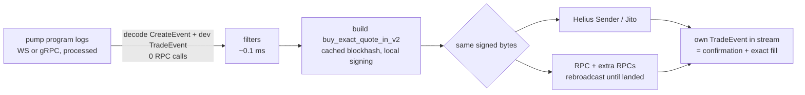

# Sol Sniper

A low-latency [pump.fun](https://pump.fun) sniper for Solana. It detects launches from the program's log stream, decides in microseconds, builds and signs the buy locally, and sends the same signed transaction over several landing paths at once. It then manages each position with take-profit tiers, stop loss, trailing stop, dev-dump detection and time exits.

> **Risk warning.** Memecoin sniping loses money more often than not. Most launches go to zero, many are built to rug snipers, and this software can have bugs. Run it in paper mode first, use a dedicated hot wallet holding only what you can afford to lose, and read the code before trusting it with funds. Nothing here is financial advice.

## Why it is fast

The previous version detected mints through `InitializeMint` logs, randomly dropped 30% of them, re-fetched every transaction over RPC, polled Jupiter every 30 s for a market, and then waited for a human to click through a browser wallet popup. That adds up to seconds or minutes per snipe. This version removes every one of those steps:



- **Zero round-trips on the hot path.** The create transaction's logs carry the coin's name, creator, token program and the curve's reserves after the dev's buy. The bot decides and prices from those alone. Blockhash, fee config, fee recipients and PDAs are all precomputed or cached.
- **Earliest possible detection.** A websocket `logsSubscribe` works out of the box. Yellowstone gRPC (Triton, Helius LaserStream) adds reconnect with slot backfill. `GRPC_DESHRED=true` goes further and sees launches in shreds, *before* the create transaction has executed; the dev buy is reconstructed from instruction arguments.
- **Multi-path landing with no double-buy risk.** One signed transaction goes to Helius Sender or Jito plus your RPCs at the same time. Because every path carries the same signature, it can only land once. Plain RPCs are rebroadcast every 400 ms until the transaction lands or its blockhash expires. Connections to every path are kept warm.
- **Streaming confirmation.** Your own trade shows up in the same log stream at `processed`. That confirms the transaction and gives the exact tokens and SOL filled, without waiting on a status poll.
- **Streaming prices.** Every pump trade carries the curve's post-trade reserves, so open positions are repriced on every trade, not on a timer.

The dashboard shows the latency you actually get: detect→send percentiles, land time, and how many slots after launch your buy landed.

## Why it is accurate

- **Current protocol.** It uses pump.fun's unified `buy_v2` / `sell_v2` / `buy_exact_quote_in_v2` instructions with Token-2022 mints, the 8+8+8 fee recipient sets from the live `Global` account, market-cap fee tiers from the live `FeeConfig`, holder-reward coins (creator vault = holder-rewards PDA), and mayhem coins.
- **Verified against the official SDK.** The test suite checks that `buy_v2` and `sell_v2` are **byte-identical** to `@pump-fun/pump-sdk` for both token programs. It checks that event and account decoders agree with the SDK and the published IDL. It checks that sell proceeds and exact-token buy costs match the SDK **exactly** over randomized curves.
- **Correct entry pricing.** Quotes use the curve state *after* the dev's buy in the create transaction, and fees are applied at the tier that coin's market cap falls in. `buy_exact_quote_in_v2` spends exactly your `BUY_SOL`, and slippage is enforced on the token output.
- **Exits based on what you can realize.** Gains are measured as what your remaining tokens would fetch if sold right now (curve impact and fees included), not spot price. A thin curve can't trigger a take-profit your sell wouldn't realize.
- **Exact P&L.** Fills come from your own on-chain trade events. In live mode every transaction is then reconciled against your wallet's actual lamport change (tips, priority fees, rent included), and booked P&L is corrected if the estimate was off. Paper P&L deducts estimated tips and fees so it isn't flattered.
- **Realistic paper trading.** Paper fills happen against the live curve after `PAPER_LATENCY_MS`. If others bought in that window and your slippage limit is breached, the paper buy fails, as the real one would. With `SIMULATE_DRY_RUN=true` and a funded wallet, each would-be trade is also run through `simulateTransaction` against the real program.

## Quick start

Requires Node.js ≥ 22.19.

```bash
npm install

# 1. Offline demo: simulated chain + dashboard, no RPC key needed
npm run demo                # open http://localhost:8787

# 2. Paper trading against mainnet
cp .env.example .env        # set RPC_URL (a paid, low-latency RPC)
npm run dev                 # open http://localhost:8787
npm run supervise           # or: unattended, restarted after crashes (see Running unattended)

# 3. Live trading: only after you have watched paper results for a while
#    set DRY_RUN=false and PRIVATE_KEY (or KEYPAIR_PATH) in .env
npm run build && npm start
```

Open positions are persisted in `data/positions.json` and resume monitoring after a restart. Every buy, sell, close and reconciliation is appended to `data/trades.jsonl`, and every launch the bot sees is recorded for later analysis (see [Learning from data](#learning-from-data)).

## Survival: the bot keeps itself alive

The bot is built to protect its own bankroll. It sizes trades to what it can afford, and it stops itself before it bleeds a wallet dry.

- **Sizing follows the bankroll.** With `SIZING=fixed` every trade is `BUY_SOL`. With `SIZING=fraction` every trade is `BUY_FRACTION_PCT` of the free balance, capped at `BUY_SOL`. In both modes a trade shrinks to what is affordable when funds run low.
- **An exit reserve is never spent.** `MIN_SOL_RESERVE` is kept back so open positions can always pay their sell fees.
- **Trades that fees would eat are refused.** A trade must be large enough that tips and priority fees for the round trip stay under `MAX_FEE_DRAG_PCT` of it. With the defaults the minimum viable trade is ~0.028 SOL.
- **Defensive mode.** Once equity (balance plus open positions) falls `DEFENSIVE_DRAWDOWN_PCT` below its peak, trade size is halved until it recovers.
- **Self-shutdown.** When the wallet can't fund a viable trade, the bot goes *critical* while open positions may still bring money back. Once it is flat and still short, it declares itself **dead**, records why in `data/survival-{paper,live}.json`, and exits with **code 3**. A wallet at 0 counts too.
- **A dead bot stays dead.** On restart it refuses to run and prints how much SOL it needs. Top up the wallet (or set `PAPER_RESET=true` for paper mode) and it revives by itself. Under systemd use `RestartPreventExitStatus=3` so it isn't restarted in a loop.

Paper mode runs the same rules against a simulated wallet (`PAPER_START_SOL`), so you can watch the bot live and die before it touches real funds. The dashboard's **Vitals** tile shows state, equity, next trade size and runway (how many minimum-size trades are left).

> Survival rules keep the bot from spending money it doesn't have. They don't make it profitable. Only the strategy can do that, and most snipers lose.

## Learning from data

The bot's own trades are a small sample. The launches it *didn't* buy are the bigger lesson. `RECORD_LAUNCHES=true` (the default) writes every launch to `data/launches/<day>.jsonl`, bought or not. Each record holds:
- the features the bot decided on (dev buy, supply share, curve state, creator history, name, fees);
- the verdict and reason;
- every trade on the coin for `RECORD_HORIZON_MIN` minutes (past `RECORD_MAX_TRADES`, a thinned price path: one trade per second, every 2% move and every dev trade, so runners stay replayable to the end);
- the bot's own result if it traded the coin.

Recording happens after decisions, so it costs no latency. Let the bot collect a few days of data (paper mode is fine), then run:

```bash
npm run analyze             # report: what works, what doesn't, suggested filter values
npm run backtest            # grid search over exit settings (TP tiers, SL, trailing, hold, stale)
npm run research            # is there a profitable strategy at all, anywhere within the bounds?
```

Both tools replay the recorded launches through the bot's **own** filter, momentum and exit functions, with fills after `PAPER_LATENCY_MS`. `analyze` reports:
- what the current settings would have made;
- whether each filter's rejects really were losers (*helps* or *costs you*);
- which features separate winners from losers;
- threshold changes that would have done better;
- how closely the replay matches the bot's actual trades, as a calibration check.

`backtest` ranks hundreds of exit configurations in seconds.

Every suggestion is validated against overfitting. Settings are chosen on the older 70% of the data and only recommended if they also beat the current settings **and make money** on the newest 30%, which they were never tuned on. A setting that merely loses less, usually by trading less, is reported as such and not recommended. Reports are saved to `data/reports/`.

Both tools replay what the bot actually runs with, autotuned settings included. The replay-vs-bot check only compares trades the bot made with the same settings. Features like "net SOL in first 3s" are marked ⏱: they are only known seconds after launch, so they point towards momentum entry rather than being usable by an instant buy.

### Research: is there an edge at all?

`analyze` and `backtest` look at the settings you have and what is near them. `npm run research` asks the bigger question: does *any* strategy within the bounds make money on this data? It searches entry mode, momentum thresholds, insider filters, launch filters and exits together, starting from nine very different strategies (blind sniping, patient momentum, strict momentum with insider filters, quick exits, slow exits, your settings and patient momentum with a moonbag, and following smart money) and improving each step by step. It takes up to 10 minutes by default (`-- --budget=20` for more, `-- --days=3` for recent data only).

The search is honest by construction. The recordings are split by time into three parts:
1. **Search (oldest 60%).** Strategies are found here. Each one is scored *without its single best trade*, so a strategy that lives off one lucky coin scores low.
2. **Validation (next 20%).** The ten strongest compete here; the best one is chosen.
3. **Test (newest 20%).** The winner must make money here, in both halves, and without its best trade. Neither the search nor the choice ever saw this part.

The report (in `data/reports/`) gives the verdict, the current settings next to the best candidate on all three parts, every gate, and the `.env` lines to use it. *None held up* is a real answer: it means no strategy within the bounds made money on data it wasn't chosen on, and the bot is right to keep observing.

To try other settings on the same data, set them for one run. In PowerShell: `$env:ENTRY_MODE="momentum"; npm run analyze` (and `Remove-Item Env:ENTRY_MODE` afterwards). In bash: `ENTRY_MODE=momentum npm run analyze`. These tools never change settings; the autotuner below does, in paper mode only.

## Prove it first: no edge, no trades

A fresh bot doesn't know whether its settings make money, and blind sniping usually doesn't: on pump.fun most launches never trade again after the first seconds, and every one of those costs the round-trip fees (~8% of a 0.05 SOL trade at the default tips). So with `REQUIRE_EDGE=auto` (the default whenever launches are recorded), the bot only buys while the settings in effect make money on the newest recorded launches.
- **Until then it observes.** It watches and records every launch, which is how it learns, but spends nothing. The dashboard header shows **observing** or **trading**, and skipped launches say why.
- **The proof.** Every hour it replays the settings in effect on the newest 30% of the recordings. It needs `AUTOTUNE_MIN_LAUNCHES` launches over `AUTOTUNE_MIN_HOURS`, enough trades, a profit of at least `AUTOTUNE_MIN_EDGE_PCT`% of the trade size per trade, and a profit that doesn't hang on one lucky trade. With operating costs set (below), the profit must also cover them.
- **It stops when the edge goes.** If the market turns and the settings stop making money, buying pauses again instead of bleeding the wallet. A proof older than three hours no longer counts.
- **Settings that change get their own proof.** After a rollback or a revert, the bot checks the new settings before it trades on them. A candidate adopted by autotune is only adopted once it made money on the newest data, so that counts as its proof.

Survival rules stay the last line of defence. Set `REQUIRE_EDGE=false` to trade regardless (the offline demo does this).

## Autotune: the bot tunes itself (paper first)

Every `AUTOTUNE_INTERVAL_HOURS` (default 6) the bot looks for better settings in its own recordings. The work runs in a worker thread, so the trading loop never waits on it. What happens next depends on `AUTOTUNE`:

| Mode | What it does |
| --- | --- |
| `paper` (default in paper mode) | Adopts a validated candidate straight away, then puts it on probation. |
| `suggest` (default live) | Only proposes. The candidate shows on the dashboard and in `data/tuning/report.md` as `.env` lines; you decide. |
| `live` (only when set explicitly) | Live trading. Every candidate is first shadow-tested, then adopted at reduced size until its probation passes (see below). |
| `off` | Nothing. Also the result when `RECORD_LAUNCHES=false`. |

`AUTOTUNE=auto` never picks `live`. The config refuses `AUTOTUNE=paper` with `DRY_RUN=false`, `AUTOTUNE=live` in paper mode, and `AUTOTUNE=live` without the edge gate. The tuner checks again before it changes anything.

**Exploring while observing.** A nearby step can't help when the current settings are far from anything that works. So while the edge gate holds the bot back (nothing is traded on the settings), each cycle whose regular search finds nothing also runs the full `npm run research` search for up to 3 minutes. If it finds a strategy that passes every gate on the validation and test parts, `paper` adopts it in one jump, beyond the usual step and change limits but within the hard bounds, and it goes on probation like any other adoption; `suggest` proposes it. Its test result counts as its proof, so the bot starts trading on it. Exploration never runs once the bot is trading, never in `AUTOTUNE=live`, and never without the edge gate. The dashboard and `data/tuning/report.md` show the last exploration (how many strategies it tried, and the verdict).

**Live autonomy (`AUTOTUNE=live`).** Real money gets extra brakes:
1. **One change at a time.** A candidate changes one setting, so a loss can be traced to its cause.
2. **Shadow test.** A validated candidate is not traded at first. It is replayed next to the current settings on launches that arrive after it was found, for `AUTOTUNE_PROBATION_TRADES` trades. If it does worse, it is dropped and never proposed again for `AUTOTUNE_DAYS`.
3. **Reduced stake.** Once it passes, it goes live at `LIVE_PROBATION_SIZE_PCT`% of the normal trade size (default 50%) and starts a regular probation. If it fails, it is rolled back.
4. **Its own proof.** The edge gate checks the new settings themselves before the bot trades on them.

**Strict limits.**
- **What it can change.** Only which coins to buy, when, and when to sell:
  - entry: `ENTRY_MODE` (instant or momentum), the momentum thresholds `MOMENTUM_MIN_BUYERS`, `MOMENTUM_MIN_NET_BUY_SOL`, `MOMENTUM_MAX_SELL_RATIO`, `MOMENTUM_MIN_AGE_MS`, `MOMENTUM_MAX_AGE_MS`, the insider filters `MOMENTUM_MAX_EARLY_BUY_SOL`, `MOMENTUM_MAX_TOP_BUYER_PCT` (each can also be switched off), and smart money `MOMENTUM_MIN_SMART_BUYERS` (0 to 3);
  - filters: `DEV_BUY_MIN_SOL`, `DEV_BUY_MAX_SOL`, `DEV_MAX_SUPPLY_PCT`, `MAX_ENTRY_MCAP_SOL`, `CREATOR_MAX_LAUNCHES`;
  - exits: `TAKE_PROFIT`, `STOP_LOSS_PCT`, `TRAILING_STOP_PCT`, `TRAILING_ARM_PCT`, `MAX_HOLD_SECONDS`, `STALE_SECONDS`, `EXIT_ON_DEV_SELL`, and the moonbag: `MOONBAG_PCT` (on or off), `MOONBAG_SECURE_PCT`, `MOONBAG_STOP_BUFFER_PCT`, `MOONBAG_TRAILING_PCT`.
- **What it never touches.** Trade size, reserve, tips, fees, slippage, risk limits and survival rules.
- **How far it can move.** Each setting has hard bounds (for example stop loss 10–60%, max hold 30–1800s, momentum net buy 0.05–20 SOL, insider buys 0.2–50 SOL, top holder 0.5–20%, moonbag 10–50%, moonbag trailing stop 15–70%), and one adoption moves it at most one step (for example ±10 points of stop loss, at most 2× the hold time, ±3 momentum buyers). Switching the entry mode, the dev-sell exit, an insider filter or the moonbag counts as one step. Exploration (above) is the one exception to the step limit, and only while nothing is traded. One adoption changes at most `AUTOTUNE_MAX_CHANGES` settings (default 3).

**Gates.** The search sees only the older 70% of the recordings. A candidate is adopted only if every gate passes on the newest 30%:
1. **Enough data:** `AUTOTUNE_MIN_LAUNCHES` launches over `AUTOTUNE_MIN_HOURS`.
2. **Enough trades:** enough simulated trades in both parts.
3. **Wins out of sample:** it beats the current settings by at least `AUTOTUNE_MIN_EDGE_PCT`% of the trade size per trade.
4. **Profitable out of sample:** it makes money on its own.
5. **Consistent over time:** it wins in both halves of the test period.
6. **Not one lucky trade:** it still wins without its single best trade.
7. **Drawdown in check:** its drawdown is not materially worse.

**Probation and rollback.** An adopted change is replayed on launches recorded *after* the adoption, which no search has ever seen, next to the settings it replaced. It is checked at least hourly. Once the new settings have made `AUTOTUNE_PROBATION_TRADES` replayed trades:
- if it did at least as well, it is kept;
- otherwise it is rolled back, tuning pauses for `AUTOTUNE_COOLDOWN_HOURS`, and those settings are not tried again for `AUTOTUNE_DAYS`.

Only one change is on probation at a time.

**Your .env stays in charge.** Tuned values live in `data/tuning/state-paper.json` and survive restarts. As soon as you edit any tunable setting in `.env`, the overrides are dropped and your values apply. The dashboard's **Autotune** panel shows:
- the last decision with every gate;
- what is on probation;
- the settings that differ from `.env`, with a button to go back to `.env`;
- the history of adoptions.

Every cycle is logged to `data/tuning/history.jsonl`. `data/tuning/report.md` holds the last decision and the `.env` lines needed to keep the tuned settings, or to use them live.

> Autotune picks the best of the nearby settings on recent data. It can't find an edge that isn't in the data, and a market that changes faster than the tuner can learn will still cost money. That is why it starts in paper mode.

## Running unattended

`npm run supervise` builds the bot and keeps it running:
- **Restarts.** After a crash, or when it stops responding (no heartbeat for 90 s), it restarts after 5 s, then 10 s, 20 s, and so on up to 5 min. It keeps trying through long network outages, and a stable run resets the delay.
- **When it stays down.** After Ctrl-C, after the bot declares itself dead (exit code 3: it waits for a top-up), or after a configuration error (exit code 78: fix `.env`).
- **Autostart on Windows.** Task Scheduler → *Create Task* → trigger *At log on* → action `npm`, arguments `run supervise`, *Start in* the bot's folder.
- **Linux.** A systemd service with `ExecStart=npm run supervise` (or `node dist/index.js` with `Restart=on-failure` and `RestartPreventExitStatus=3 78`).

Also for long runs:
- **Stalled streams.** A log stream that answers pings but delivers nothing for 2 minutes is reconnected.
- **Lean paper mode.** Paper mode polls the blockhash once a minute instead of every second, because paper fills don't need it.
- **Metered usage.** The dashboard header shows streamed data per day. The tooltip adds RPC calls and, for Helius, the estimated credits per day (about 20 credits per streamed MB plus 1 per request), so you can check your plan covers it.

**Notifications (Telegram).** The bot reports what happens while nobody watches, in Dutch (logs, dashboard and reports stay English):
- starts and stops;
- trading enabled or paused (edge);
- autotune adoptions, shadow tests and rollbacks;
- vitals changes and death;
- feed outages longer than a minute, or a stream that stops delivering (for example when RPC credits run out);
- **a digest** every `NOTIFY_DIGEST_HOURS` (default 6) on the local clock of `NOTIFY_TIMEZONE`: trades, win rate and P&L of the period, the same **without the single best trade**, best and worst coin, the running total, open positions and moonbags, equity and status;
- a daily summary at `NOTIFY_DAILY_HOUR_UTC`, covering status, the last 24h, costs and usage;
- **highlights** (`NOTIFY_HIGHLIGHTS`): a free ride as it happens, an open position passing 3x, 5x, 10x, 20x…, and a new equity record (each at least 5% above the last one announced);
- with `NOTIFY_TRADES=true`, every closed trade.

The reports count trades from a ledger in `data/notify.json` that keeps a week and survives restarts. The first time, it is filled from the trade journal.

**Commands (Telegram).** With `NOTIFY_COMMANDS=true` (the default) the bot answers in the configured chat. Other chats are ignored, and so are commands sent while the bot was down.

| Command | What it does |
| --- | --- |
| `/status` | Trading or observing, equity, vitals, open positions and moonbags, today's result |
| `/vandaag` | Today's trades (local day): result, win rate, without the best trade, best and worst |
| `/posities` | Open positions and moonbags with gain, value, peak and age |
| `/pauze` | Stop buying; open positions are still managed. The pause survives restarts. |
| `/hervat` | Buy again. It only lifts its own pause, never a daily loss limit or death, and says so when the edge gate still holds the bot back. |
| `/verkoopalles` | Sell every open position and pause buying, after a tap on the confirmation button (valid 60 s) |
| `/help` | The list |

English names work too (`/today`, `/positions`, `/pause`, `/resume`, `/sellall`). Only one program can read a bot's commands: don't run `npm run telegram` while the bot is running.

Setup:
1. Create a bot with @BotFather and set `TELEGRAM_BOT_TOKEN`.
2. Send the bot a message and run `npm run telegram`. It prints your chat id.
3. Set `TELEGRAM_CHAT_ID` and run it again. It sends a test message.

**Cost of existence.** A bot that has to keep itself alive also has to pay for itself. Set `OPERATING_COST_PER_MONTH` (with `OPERATING_COST_CURRENCY` usd, eur or sol) to what the RPC plan and server cost.
- **The ledger.** The bot converts the costs to SOL at the current price and accrues them while it runs. It sets them against the P&L of its trades in `data/costs-{paper,live}.json`.
- **On the dashboard.** The *Net after costs* tile shows the result.
- **In the edge gate.** The bot only trades while its recent profit, scaled to a day, covers the daily costs.

## Strategy

### Entry

| Mode | Behaviour |
| --- | --- |
| `ENTRY_MODE=instant` | Buy the moment a launch passes the filters (block-0 sniping). Fastest; most exposed to bundled launches and instant rugs. |
| `ENTRY_MODE=momentum` | Watch a passing launch and buy only once it has `MOMENTUM_MIN_BUYERS` distinct buyers, `MOMENTUM_MIN_NET_BUY_SOL` net inflow excluding the dev, a sell/buy ratio under `MOMENTUM_MAX_SELL_RATIO`, and the dev has not sold, all within `MOMENTUM_MAX_AGE_MS`. Optional insider filters skip it when non-dev wallets bought more than `MOMENTUM_MAX_EARLY_BUY_SOL` in the first 0.5s (bundled with the launch) or one wallet other than the dev holds more than `MOMENTUM_MAX_TOP_BUYER_PCT`% of the supply. With `MOMENTUM_MIN_SMART_BUYERS` it also waits for smart money (below). |

#### Smart money: follow wallets that keep getting in early on runners

Copy traders profit by buying when wallets with a track record buy. The bot learns such wallets from its own recordings:

1. **What it logs.** For every finished launch, `data/wallets/<day>.jsonl` gets the early buyers (each wallet's first buy within the first minute, the dev and the bot itself aside). For each it notes whether the price later reached twice what the wallet paid (a *hit*).
2. **Who is smart.** A wallet needs at least 3 early buys. Its hit rate, shrunk for small samples (hits / (buys + 2)), must be at least 25% and at least twice the average wallet's. Wallets that buy everything, and insiders whose coins dump, don't qualify.
3. **No look-ahead.** A launch only counts once its recording has ended, so a wallet is always judged on what was known at that moment. Live, the book is built at startup from the last 14 days of logs and grows as launches finish. Every replay walks forward through time the same way.
4. **The signal.** With `MOMENTUM_MIN_SMART_BUYERS=1`, momentum entry waits until a smart wallet has bought, and the launch reason says so (`5 buyers (1 smart)`). The other momentum thresholds still apply; set them low to follow smart money alone.

`npm run analyze` has a *Smart money* section: how many wallets qualify, and how launches with smart early buyers did compared with the rest. `npm run research` and autotune try the signal as soon as the data supports it. `/status` in Telegram shows how many smart wallets the bot knows. Recordings from before this existed have no buyer addresses, so it takes a few days of new data before the signal can prove itself.

### Filters

All filters run on data already in the create transaction, so they cost microseconds. They reject:

- non-SOL-paired coins, mayhem coins (`ALLOW_MAYHEM`), and holder-reward coins if disabled;
- launches missing a metadata URI;
- names or symbols matching `NAME_BLOCKLIST` (or not matching `NAME_ALLOWLIST`);
- dev buys outside `DEV_BUY_MIN_SOL`..`DEV_BUY_MAX_SOL`, or a dev holding over `DEV_MAX_SUPPLY_PCT` of supply;
- curves already past `MAX_CURVE_PROGRESS_PCT`, or above `MAX_ENTRY_MCAP_SOL`;
- serial launchers: dev wallets with more than `CREATOR_MAX_LAUNCHES` launches in the window. This history is learned from the live stream and persisted across restarts. `CREATOR_BLOCKLIST` / `CREATOR_ALLOWLIST` override it.

`REQUIRE_SOCIALS=true` additionally fetches the off-chain metadata (with a hard timeout) and requires a Twitter, Telegram or website link. This is the only filter that adds network latency.

### Exits

Checked on every trade of the coin and once per second. The order is: protective exits first, then profit-taking, then time.

1. **Dev sold** (`EXIT_ON_DEV_SELL`): exit everything.
2. **Stop loss** at `-STOP_LOSS_PCT`.
3. **Trailing stop**: once up `TRAILING_ARM_PCT`, exit if value falls `TRAILING_STOP_PCT` from its peak.
4. **Take-profit tiers**: `TAKE_PROFIT=60:50,150:100` sells 50% of the remaining position at +60%, and the rest at +150%.
5. **Max hold** (`MAX_HOLD_SECONDS`) and **stale** (`STALE_SECONDS` without any trades).
6. **Graduation**: when the curve completes, the position is sold on PumpSwap through the official SDK.

#### Moonbag: a free ride on runners

Without a moonbag, the last take-profit tier, the trailing stop and the time exits all sell everything, so a coin that turns into a runner is gone after a few minutes. With `MOONBAG_PCT=25`:

1. **Free ride.** The bot watches when selling all but 25% of the bought tokens would bring back the stake, every fee (buy, sells, tips, and the later sale of the moonbag itself) and `MOONBAG_SECURE_PCT`% profit (default 10). The moment it would, it sells exactly that. With the defaults that is at about +50%. Take-profit tiers below that point still sell first and count towards it; a stop loss or dev dump before it sells everything as usual.
2. **The moonbag rides on its own rules.** It is sold:
   - back at entry + `MOONBAG_STOP_BUFFER_PCT` (default 5%), plus what the sell transaction costs;
   - `MOONBAG_TRAILING_PCT` (default 40%) off its peak, so a runner at 5x is cashed well above entry;
   - when the dev sells (with `EXIT_ON_DEV_SELL`), or at graduation;
   - when nobody has traded the coin for `MOONBAG_STALE_SECONDS` (default 30 minutes): a dead coin, not a runner.

   **No time limit.** `MAX_HOLD_SECONDS`, `STALE_SECONDS` and the take-profit tiers no longer apply: a moonbag rides as long as the coin runs. `MOONBAG_MAX_HOLD_SECONDS` sets an optional hard limit (default 0, none).
3. **It never blocks a trade.** Moonbags don't count against `MAX_OPEN_POSITIONS`; at most `MAX_MOONBAGS` (default 10) ride at once. When they are all taken, the free ride is skipped and the normal rules apply.

The guarantee comes from the free-ride sale, not the stop: a stop is a trigger, not a price, and a rug can drop 80% in one trade before the sell lands. Because stake, fees and the secured profit are already in, the trade as a whole stays in profit even if the moonbag goes to zero.

It is a trade-off. A moonbag gives up some profit on medium winners (the free ride sells earlier than a 50% tier would) for far more on real runners. Whether that pays depends on how often coins run after you enter: `npm run research` compares both on your own recordings, and autotune can switch the moonbag on or off and tune it. A recording lasts `RECORD_HORIZON_MIN`; a moonbag still riding when it ends is counted at no more than its stop, so research never counts on a run nobody saw.

Failed sells retry immediately with slippage widening from `SELL_SLIPPAGE_BPS` to `SELL_MAX_SLIPPAGE_BPS`. After that, the exit policy retries with backoff. Full exits also close the token account to reclaim its rent.

### Risk limits

`MAX_OPEN_POSITIONS` (moonbags excluded, see above), `MAX_BUYS_PER_MINUTE`, and `DAILY_LOSS_LIMIT_SOL`, which pauses buying for the rest of the UTC day. Balance, trade size and the exit reserve are handled by [survival](#survival-the-bot-keeps-itself-alive). None of these can be overridden by a strategy signal.

## Dashboard and API

The dashboard at `http://localhost:8787` streams launches with the filter verdict and reason, open positions with live P&L, closed trades, latency, win rate, vitals and autotune state. It also has buttons to pause buying, sell 25/50/100% of a position, sell everything, manually buy any coin still on its bonding curve, run an autotune check, or revert tuned settings.

| Endpoint | |
| --- | --- |
| `GET /api/status` · `/api/positions` · `/api/launches` · `/api/config` | Read-only state (secrets redacted). |
| `POST /api/pause` · `/api/resume` | Stop/start new entries. |
| `POST /api/sell` `{ "mint": "...", "pct": 50 }` | Sell part of a position. |
| `POST /api/sell-all` | Exit everything. |
| `POST /api/buy` `{ "mint": "...", "sol": 0.1 }` | Manual buy of a bonding-curve coin. |
| `GET /api/tuning` | Edge and autotune state: trading or observing and why, last decision and gates, probation, overrides, history. |
| `POST /api/tuning/run` | Check the edge (and search, when autotune is on) now. |
| `POST /api/tuning/revert` | Back to the `.env` settings (paper autotune); tuning pauses for the cooldown. |
| `WS /ws` | Snapshot, then live events. |

The API binds to `127.0.0.1`. It rejects non-local Host headers (DNS rebinding) and cross-origin requests, and mutating calls must send JSON (so a CORS preflight is forced, which the server never approves). This means a malicious web page can't trade your wallet through your browser. Set `API_TOKEN` before binding it anywhere else, then open the dashboard with `?token=...`.

## Tuning for speed

- **Colocate.** Run the bot in the same region as your RPC and landing endpoints (Frankfurt, Amsterdam, New York or Salt Lake City are common). Point `HELIUS_SENDER_URL` at the regional sender (e.g. `http://fra-sender.helius-rpc.com/fast`).
- **Prefer gRPC** (`GRPC_URL`) over websockets if your provider offers it. Try `GRPC_DESHRED=true` if they support deshred.
- **Measure compute.** Run paper mode with `SIMULATE_DRY_RUN=true` and a funded wallet, then read `unitsConsumed` from `data/trades.jsonl`. Set `BUY_COMPUTE_UNITS` just above it: a lower limit at the same total fee means a higher per-CU price.
- **Watch "Landed slots after launch"** on the dashboard. It's the metric that matters, and it moves with tip, priority fee and region.

## Project layout

```
src/
  pump/        protocol: constants, PDAs, account/event decoding, curve + fee math, instruction builders
  feed/        log-stream (WS) and Yellowstone gRPC/deshred feeds; live per-coin market book
  strategy/    launch filters, creator reputation, momentum entry, exit policy, risk limits, survival
  learning/    launch recorder, dataset loading, replay engine, reports, autotuner (bounds, search, gates, probation, worker)
  trading/     executor (build/sign/land, paper fills, simulation), positions + P&L, PumpSwap sells
  solana/      keep-alive RPC, resilient websocket, blockhash cache, priority fees, landing, confirmation
  api/         local HTTP/WS server and the single-file dashboard
  notify/      Telegram notifier and the reporter (alerts, daily summary)
  engine.ts    wires it all together; index.ts is the entrypoint; supervisor.ts restarts it
test/          protocol checks against the official SDK/IDL, strategy units, end-to-end tests on a mock chain
scripts/     demo.ts (offline demo), analyze.ts, backtest.ts, telegram.ts (notification setup)
```

## Tests

```bash
npm test          # vitest
npm run typecheck
```

- **Protocol**: instruction bytes, event/account decoding and curve math are checked against `@pump-fun/pump-sdk` and the published IDL (`test/fixtures`).
- **Strategy**: config parsing, filters, exit policy, momentum, risk limits, and survival (sizing, fee-drag minimum, defensive mode, critical vs dead, persistence and revival).
- **Moonbag**:
  - the free-ride sale brings back stake, every fee and the secured profit, counting earlier take-profits;
  - never at a loss, and not when every moonbag slot is taken;
  - the moonbag's own rules (break-even stop with its fee, wide trailing stop, only a dead coin ends the ride, no time limit);
  - end to end, a moonbag outlasts `MAX_HOLD_SECONDS` and `STALE_SECONDS` while normal positions are closed by them;
- **Smart money**:
  - early buyers are logged with the right outcome, without the dev, the bot itself or late buyers;
  - a wallet only counts as smart with enough hits well above the average;
  - the walk-forward annotation never uses a launch that hadn't finished;
  - the live momentum rule and the replay wait for a smart buyer the same way;
  - end to end, the engine learns a smart wallet from the logs and buys only the launch it buys;
  - in the replay, a moonbag still riding when the recording ends counts at no more than its stop;
  - in the replay, a runner rides further and a crash after the free ride still leaves the trade in profit;
  - end to end, the moonbag frees its position slot and is stopped above entry;
  - recordings of busy coins thin out instead of stopping, and tuned settings saved before moonbags existed still load.
- **Edge gate**:
  - no buys (but full recording) until the settings are proven;
  - the proof is per exact settings, restored after restart, stale after 3h, and withdrawn when the market turns;
  - operating costs must be covered, with sampled data scaled up.
- **Live autonomy**:
  - a candidate is shadow-tested before any real trade;
  - one change at a time;
  - half stake during probation, full stake after;
  - a candidate that fails its shadow test is never traded or proposed again;
  - config refuses live autotune in paper mode and without the edge gate.
- **Unattended running**:
  - restart policy: no restart after a clean stop, death or a config error; growing delays after crashes and hangs, never giving up;
  - Telegram delivery: in order, waits out rate limits, drops refused messages, token kept out of the API;
  - the reporter's alerts, trade reports, debounced feed outages and once-a-day summary, in Dutch;
  - the digest on the local clock (with the result without the best trade), highlights each sent once, and the trade ledger (from the journal on first start);
  - commands: only the owner's chat, stale commands ignored, pause kept across restarts and never lifting another pause, sell-all only after a confirmation tap;
  - the operating-cost ledger: pricing, accrual while running, and restarts.
- **Autotune**:
  - every tunable value round-trips through `.env`, momentum and entry mode included;
  - it switches to momentum entry when waiting is what wins out of sample;
  - bounds and step limits hold, and trade size, fees and risk are unreachable;
  - winning settings are adopted, and settings that only won in the past are rejected (regime change);
  - probation passes and fails correctly, and positions are capacity-limited like live;
  - adopted settings survive a restart and are dropped when `.env` changes;
  - a rollback pauses tuning, and the failed settings are skipped afterwards;
  - suggest mode never changes anything;
  - the search runs in a real worker thread;
  - while observing, it explores the whole bounded range and adopts a strategy far beyond one step when it holds up, but never while trading or without the edge gate.
- **Strategy research**: finds a profitable strategy far from the current settings and proves it on the newest 20% it never used; finds nothing on a market of dead coins and rugs; needs enough data; never picks excluded settings; respects its time budget.
- **Replay**: the offline replay matches the live exact curve math to within 2 lamports, and follows TP tiers, dev-dump exits, slippage skips, momentum timing the insider signals (early bundled buys, biggest holder) and moonbags.
- **End to end**: the real engine runs against a mock chain that verifies ed25519 signatures, decodes the submitted instructions, executes them against curve math and streams back the program's events. Covered: paper take-profit, a moonbag free ride, filter rejections, momentum entry, live buy through Jito (tip, multi-path dedupe), dev-dump exit with account close, exact wallet reconciliation, failed-buy accounting, the API's security checks, a paper bot running out of money and shutting itself down (then refusing to restart), and launch recording of both rejected and traded coins.

**Not covered:** these tests can't prove landing performance or strategy profitability on mainnet. Validate with paper trading and small sizes first.

## Known limitations

- Only SOL-paired pump.fun bonding-curve coins are sniped. USDC-paired coins and other launchpads are ignored.
- Jito tip accounts are fetched from the block engine at startup; the bot refuses to start with Jito landing if that fails, rather than guess an address (override with `JITO_TIP_ACCOUNTS`).
- Paper mode can't fill graduated (PumpSwap) sells; they are booked at the last curve value.
- pump.fun changes its program regularly. When it does, update `test/fixtures/*.idl.json` from [pump-public-docs](https://github.com/pump-fun/pump-public-docs) and the `@pump-fun/pump-sdk` dev dependency, and run the tests.

## License

ISC
